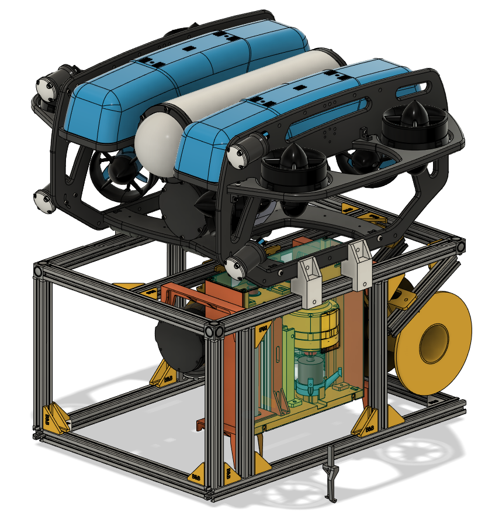
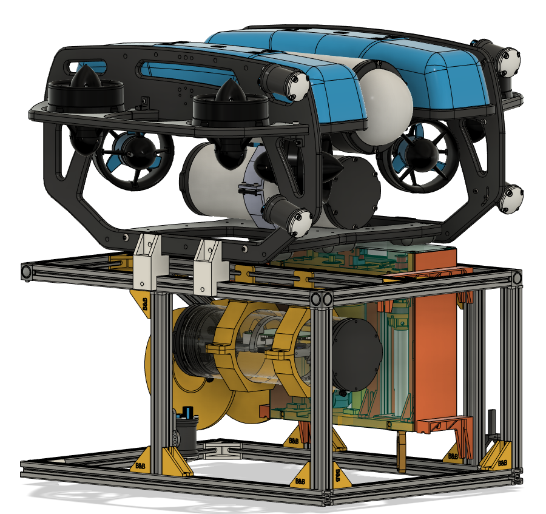

## Complete 3D model of the project

The 3D model file is too big for Github. It can be downloaded here: [NTNU open](https://hdl.handle.net/11250/3139938)  
If the link is broken, search "Toward Cleaner Oceans: Developing an ROV-Based Solution for Subsea Fishing Trash Collection" and find the attachments on NTNU open website.

The pictures are from the "Complete assembly v10.step" file.
