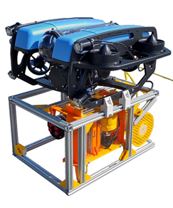

# Uboss bachelor project 2024
Code by: William Hammer & Sigbjørn N. Kleppe  

### All files can be found on NTNU open website:  
["Toward Cleaner Oceans: Developing an ROV-Based Solution for Subsea Fishing Trash Collection"](https://hdl.handle.net/11250/3139938)

## Introduction
This github project serves as the software development and documentation for the interdisciplinary bachelor thesis
"Uboss" at NTNU Ålesund the Spring of 2024. The motivation for the thesis is the development of technology relating to the problem of
ghost fishing. This project attempts to explore the possibility of utilizing ROVs to mark crab traps for further pickup,
and the possibility of performing this marking solution autonomously.

Instructions on how to get started using the software in the project is described in the README file within the
"pi" folder.

## Project abstract

Research indicates that marine litter accounts for most trash along the Norwegian coastline. The
most cost effective way to collect lost fishing gear today is through the use of anchors which are
destructive for the marine ecosystem. This project attempts to explore solutions of picking fishing
gear trough the use of ROVs that are more cost effective and less destructive to the ecosystem.

The solution proposed in this project is a marking system capable of marking the location of lost
fish traps. The ROV is equipped with a hook which is is designed to attach to the trap. Attaching
the hook and moving the ROV releases a wire spool which floats to the surface. Once the spool
has surfaced it can be retrieved and and used to winch the crab trap to collect it. If the ROV is
mounted with two of these spool and hooks the effectiveness of the retrieval is effectively doubled
as the ROV does not need to resurface between each litter collection.

The final prototype yielded promising results as the concept worked as intended. The method was
proven to work multiple times during the last field trip. The tests performed only utilized one
hook and spool meaning more testing has to be performed to see if the design is scalable. Due to
design choices and some user fault during this last trip the equipment also sustained some damage.

An autopilot as well as a fully integrated object detection was also developed during this project.
The autopilot was unfortunately never tested due to the object detection model under performing
during the final field trip. Due to camera obstructions from air bubbles, the object detection model
could not locate the crab traps properly. This meant that the autopilot was effectively blind not
knowing where the crab traps were, leading to the decision of not testing the autopilot. Under
better conditions, the object detection model appears to be a lot more accurate.

## Problem
Currently ROVs are found to be too inefficient to be used in retrieval of underwater litter.
This is in large due to the ROV being limited to picking one piece of trash at once and it having
to resurface after every pick-up. Thus other methods like pulling anchors along the seabed for
retrieval of fishing equipment is used instead. This method is harmful for aquatic life as natural
reeves are destroyed in the process. The goal should be to develop a solution utilizing ROVs for
underwater trash collection that is more efficient and less harmful to the ecosystem than current
solutions.

## Solution overview

The main concept is based around marking the crab traps using the ROV instead of directly
picking it. This can significantly increase efficiency of using ROVs for underwater fishing equipment
collection, since current solutions usually only collect one piece of litter every dive. If the ROV is
capable of marking two pieces of litter the need for resurfacing and diving is cut in half, effectively
almost doubling efficiency.

The main marking system, is mostly mechanical. The crab trap is attached securely using a hook
which is designed to easily grab the trap either on the metal structure or the netting itself. The
hook is placed within an aluminium frame to protect it from taking damage. When it’s time to
mark the trap, the hook can be extended down using the linear actuator. Once the hook is attached
to the trap, the hook can be released by thrusting the ROV upwards towards the surface. The
hook is also attached a release mechanism for the spool, this means that thrusting to release the
hook will also result in the releasing of the spool. The wire spool will then float to the surface and
effectively have marked the trap. A boat can then retrieve the spool and collect the trap using a
winch.

For the electrical part of the solution, most of the added electronics are inside the custom electronics
tube. The main logic controller is the on board Raspberry Pi 5. It also serves as an interface
between the on board components and messages from QGroundControl (QGC) and the BlueROV.
This makes it possible to control the customly added light and camera servo angle as well as to
toggle the custom autopilot from the surface computer using a joystick through the user interface.
A custom video stream is also added to see the hook whilst attaching to the litter. To switch
between these streams on the surface computer, a button is added to the user interface in a custom
build of QGC. The added stream also has the option of performing object detection using a
customly trained YOLOv8 model. This is mostly to use with the autopilot, but could also be used
to help humans locate traps that are difficult to see.

The aforementioned autopilot is not a requirement of the main solution, but rather an additional
bonus goal. One of the goals of this project is to create the foundation of a potential autonomous
solution of crab trap retrieval. Removing some of the manpower needed to operate the ROV further
adds to the efficiency and lessens investment costs for the solution.

## Electrical components

The project utilizes a BlueROV2 heavy which is made for modular customization. The group has made a custom extension
module to the BlueROV2 heavy consisting of a custom electronics tube, fitted with the following equipment:

* **Raspberry Pi 5:** Responsible for the on-board logic. Communicates between the surface computer and the ROV, as well as
  it controls the custom on board equipment. The Raspberry is supposed to run the main.py script when the
  vehicle is in operation.

* **h264 USB camera:** Used for the camera stream to the ground control station on the surface computer.

* **Servo:** Moves the camara mount such that a greater field of view is possible.

* **BlueRobotics basic ESC:** Controls the BlueRobotics T200 thruster attached to the linear actuator with the use of PWM.

* **BlueRobotics T200 Thruster:** Attaches to the linear actuator to attract and re-tract the crab trap attachment hook.

* **Serial to RS485 adapter:** Converts RS485 signal from the ping sonar to serial communication to the Raspberry Pi.

* **Ping sonar:** Sonar distance sensor to measure the distance from the seabed.

* **Subsea light:** Lighting to help see below the surface. 

