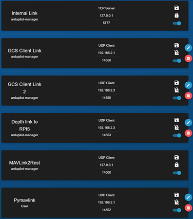

## Setup

All of the code is written exclusively in Python. Thus all required Python libraries are contained neatly in the included
requirements.txt file. This file should contain all pip libraries used during the project.
It is advised to utilize a fresh Python 3.11 Virtual environment on your Raspberry before installing 
the libraries. Once the libraries are properly installed, the main.py file can be run from within the virtual environment.
This initiates the program, and the Raspberry Pi will start communicating with the BlueROV as well as QGroundControl if 
these are properly connected and powered.

The project utilizes PyMavlink to communicate to both the ROV and surface computer over ethernet/IP. Thus it is important
to note that any attempt of building this project, requires the Raspberry Pi 5's ethernet Ip to be set to static with the
ip: "192.168.2.3" using the network manager and NOT dhcpcd which is the old standard. It is also important to manually 
add custom endpoints to the BlueROV2 heavy BlueOS which can be done following the [guide by BlueRobotics](https://blueos.cloud/docs/blueos/1.0/advanced-usage/).
In the below images an overview of the added as well as original endpoints are shown. For the added endpoints the owner 
has to be set top "ardupilot-manager". The type also needs to be configured as "UDP Client".

## File structure
The project mainly consists of two directories; the "Python" directory containing all python scripts utilized by the
project and the "Image_Recognition" directory which contain all the YOLO object detection algorithms which were trained
during the development of this project. The Python directory also include three subdirectories "Hardware_Interface",
"logs" and "Other". Both the Hardware_Interface and Other directories contain further Python scripts used in the project.
The logs subdirectory however, contain all logs which are stored using the different scripts.

<!-- 
### Python files:
* **camera_streamer.py:** Introduces the "VideoStreamer" class 

This is a markdown comment
-->

## Threads

Overview of all threads in this project is described in the bachelor thesis "Toward Cleaner Oceans: Developing an ROV-Based Solution for Subsea Fishing Trash Collection" under "Method", "Software", "Main code threading structure".